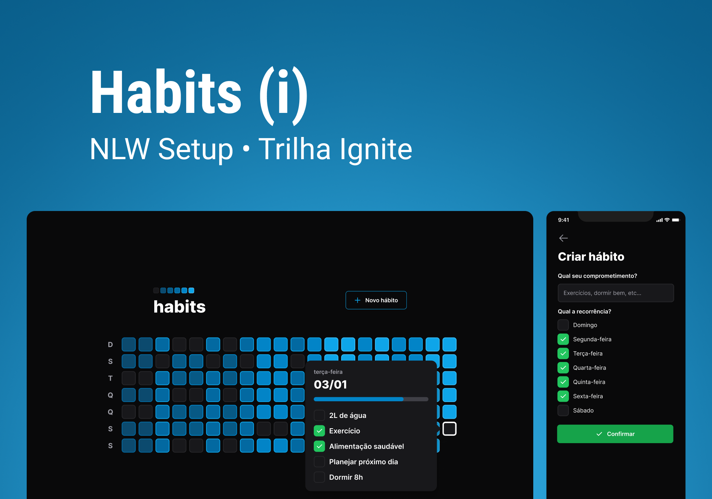

<h1 align="center">📌 NLW Setup Habit 📌</h1>

<p align="center">  <a href="#sobre">Sobre</a> • <a href="#layout">Layout</a> • <a href="#aplicacao">Aplicação</a>  • <a href="#techs">Tecnologias</a> • <a href="#autor">Contato</a> • <a href="#licenca">Licença</a> </p>

<h2 id="sobre"> 📋 Sobre o projeto</h2>
  
  **NLW Setup Habit**  é o projeto desenvolvido durante a trilha Ignite da  **Next Level Week**, um evento online produzido pela  [**Rocketseat**](https://www.rocketseat.com.br/).

O projeto consiste em uma aplicação com a temática do controle do seus hábitos, conseguindo criar e marcando se estiver realizado, e com isso conseguirá observar os dias que você terá sucesso ao realizar o hábito criado.

<h2 id="layout"> 🎨  Layouts</h2>

<p align="center">
 
</p>

<h2 id="aplicacao"> 🎲  Rodando essa aplicação:</h2>

Antes de começar, você vai precisar ter instalado em sua máquina as seguintes ferramentas: [Git](https://git-scm.com/), [Node.js](https://nodejs.org/en/), [Yarn](https://yarnpkg.com/). Além disto é bom ter um editor para trabalhar com o código como [VSCode](https://code.visualstudio.com/).

```
# Clone este repositório
$ git clone https://github.com/wesleywisch/NLW-Setup-habit.git

# Acesse a pasta do projeto no terminal
$ cd backend, depois cd frontend e cd mobile

# Instale as dependências
$ yarn ou npm install

# Iniciando Server do projeto
$ npx prisma migrate deploy
$ npm run dev

# Execute a aplicação
$ yarn dev ou npm run dev
```

 <h2 id="techs"> 💻 Tecnologias</h2>
 As seguintes ferramentas foram usadas na construção do projeto:

- [ReactJS](https://reactjs.org/)
- [TailwindCSS](https://tailwindcss.com/)
- [TypeScript](https://www.typescriptlang.org/)
- [ViteJS](https://vitejs.dev/)
- [Prisma](https://www.prisma.io/)
- [Fastify](https://www.fastify.io/)
- [Expo](https://expo.io/)
- [React Native](https://reactnative.dev/)
- [React Navigation](https://reactnavigation.org/)

 <h2 id="autor"> 🦸 Contato</h2>

[Wesley Wisch](https://www.linkedin.com/in/wesley-wisch)

[](https://www.linkedin.com/in/wesley-wisch) [](https://www.instagram.com/wesley_wisch/) [](mailto:wesley_wisch@hotmail.com)

<h2 id="licenca"> ⚠️  Licença</h2>

Esse projeto esta sobre a licença [MIT]().
